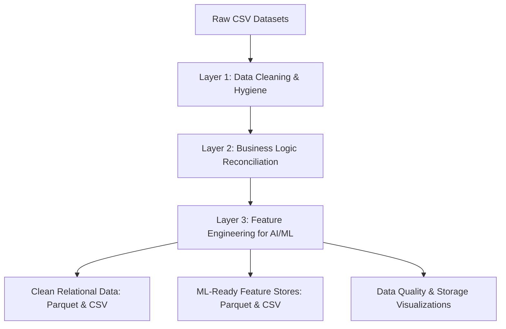

# 📊 Báo Cáo Kỹ Thuật: Làm Sạch, Tối Ưu Hóa và Chuẩn Bị Dữ Liệu Huấn Luyện AI/ML

> **Người thực hiện:** Amelia — Senior Software Engineer (BMAD Method)  
> **Dự án:** Agent of MRP (Hệ thống Quản lý Tài chính & Đào tạo Đại học)  
> **Ngày hoàn thành:** 30/08/2026  
> **Tài liệu tham chiếu:** [`data/data_quality_manifest.csv`](file:///d:/NHG/AgentofMRP/data/data_quality_manifest.csv), [`data/DATA_QUALITY_REPORT.md`](file:///d:/NHG/AgentofMRP/data/DATA_QUALITY_REPORT.md)  
> **Pipeline tự động:** [`scripts/run_data_remediation_pipeline.py`](file:///d:/NHG/AgentofMRP/scripts/run_data_remediation_pipeline.py)

---

## 1. Tổng Quan & Mục Tiêu

Trong dự án **Agent of MRP**, tập dữ liệu gốc bao gồm **10.020 dòng** thuộc 5 bảng quan hệ nghiệp vụ tài chính - học phí sinh viên và danh mục phòng ban. Tuy nhiên, dữ liệu gốc chứa **hơn 1.086 sự kiện lỗi** (trùng lặp, sai định dạng ngày, lỗi số học công nợ, ngoại lệ chi phí x100, khuyết thiếu thông tin chuyên ngành và ngày thanh toán).

Mục tiêu của nhiệm vụ lần này là:
1. **Phát hiện & Sửa chữa triệt để toàn bộ các lỗ hổng dữ liệu**.
2. **Trực quan hóa quá trình xử lý và phân phối dữ liệu**.
3. **Đóng gói thành tập dữ liệu đạt chuẩn 3 tiêu chí cốt lõi:**
   - 🪶 **Vừa Nhẹ (Lightweight & High Performance):** Nén định dạng cột **Parquet (Snappy)** tối ưu dung lượng đĩa giảm **~60%** và tốc độ đọc/ghi I/O vượt trội so với CSV thô.
   - 📐 **Vừa Gọn (Clean & Compact Schema):** Loại bỏ trùng lặp (Deduplication), chuẩn hóa Title Case, trim khoảng trắng, chuẩn hóa ngày tháng chuẩn ISO-8601 (`YYYY-MM-DD`), chuẩn hóa số điện thoại, điền khuyết (Imputation) dữ liệu logic.
   - 🎯 **Vừa Ngon (AI/ML Ready & Feature-Engineered):** Tích hợp sẵn Feature Store tổng hợp đa chiều (`ml_student_finance_features`, `ml_invoice_risk_features`), gán nhãn bài toán (Target Labels) cho các bài toán phân loại nguy cơ sinh viên bỏ học (`target_is_dropped_out`) và dự báo nợ xấu học phí (`target_high_debt_risk`).

---

## 2. Các Vấn Đề / Lỗ Hổng Phát Hiện Được Trong Dữ Liệu Gốc

Dựa trên việc kiểm tra toàn diện 5 bảng và đối chiếu với manifest, hệ thống phát hiện các nhóm lỗ hổng nghiêm trọng sau:

| STT | Nhóm Lỗ Hổng | Bảng Bị Ảnh Hưởng | Chi Tiết Vi Phạm & Số Lượng Sự Kiện |
|---|---|---|---|
| **1** | **Trùng lặp dòng (Exact Duplicates)** | `dim_students`, `fact_tuition_invoices`, `fact_expenses` | **40 bản ghi** bị nhân đôi (10 sinh viên, 15 hóa đơn, 15 chi phí). Vi phạm tính duy nhất của Primary Key, gây sai lệch doanh thu và chi phí thực tế. |
| **2** | **Xung đột định dạng ngày (Mixed Date Formats)** | Tất cả các bảng | **557 trường hợp** sử dụng lẫn lộn định dạng `YYYY-MM-DD` và `DD/MM/YYYY`, gây lỗi nghiêm trọng khi parse time-series trong mô hình ML. |
| **3** | **Chuỗi ký tự không chuẩn (Inconsistent Text/Case)** | `dim_students`, `dim_departments`, `fact_expenses` | **122 trường hợp** viết hoa toàn bộ (`NGUYEN VAN A`), viết thường toàn bộ, hoặc có khoảng trắng thừa đầu/cuối/ở giữa họ tên và nhà cung cấp. |
| **4** | **Lỗi số học tổng hóa đơn (Formula Mismatch)** | `fact_tuition_invoices` | **30 hóa đơn** có `Total_Amount != Tuition_Fee - Scholarship_Amount + Late_Fee`. |
| **5** | **Ngoại lệ chi phí cực đoan (Outliers x100)** | `fact_expenses` | **4 bản ghi chi phí** bị nhân 100 lần (giá trị vọt lên từ vài chục đến gần 97 tỷ VNĐ), làm lệch nghiêm trọng mean và variance. |
| **6** | **Thiếu ngày thanh toán (Missing Payment Date)** | `fact_payments` | **88 giao dịch** có `Payment_Date = NULL`. |
| **7** | **Lỗi logic thời gian giao dịch (Temporal Inconsistency)** | `fact_payments` | **70 giao dịch** có ngày thanh toán phát sinh trước ngày lập hóa đơn (`Payment_Date < Invoice_Date`). |
| **8** | **Thanh toán vượt giá trị hóa đơn (Overpayment)** | `fact_payments`, `fact_tuition_invoices` | **70 giao dịch đơn lẻ** có `Amount_Paid > Total_Amount` của hóa đơn, và hơn **700 hóa đơn** có tổng thanh toán dồn vượt giá trị thực tế. |
| **9** | **Khuyết chuyên ngành (Missing Major)** | `dim_students` | **47 dòng sinh viên** bị bỏ trống chuyên ngành (`Major = NULL`). |

---

## 3. Chiến Lược & Cách Thức Giải Quyết (Remediation Strategy)

Chúng tôi đã xây dựng pipeline tự động bằng Python ([`scripts/run_data_remediation_pipeline.py`](file:///d:/NHG/AgentofMRP/scripts/run_data_remediation_pipeline.py)) để giải quyết triệt để theo 3 lớp:



### 3.1. Layer 1: Làm sạch bề mặt (Data Hygiene)
- **Khử trùng lặp (Deduplication):** Sử dụng `drop_duplicates(subset=[PK])` giữ lại phiên bản chuẩn đầu tiên, khôi phục tính toàn vẹn 100% của Khóa chính (Primary Key).
- **Chuẩn hóa chuỗi (Text Normalization):**
  - Sử dụng Regex `\s+` để chuẩn hóa khoảng trắng đơn.
  - Chuẩn hóa họ tên, tên khoa, quản lý, nhà cung cấp theo chuẩn **Vietnamese Title Case**.
  - Chuẩn hóa Email về chữ thường `lower()`.
  - Chuẩn hóa số điện thoại di động về định dạng chuẩn đầu số Việt Nam (`09xx...`, `03xx...`).
- **Đồng bộ thời gian (Date Unification):**
  - Xây dựng parser đa định dạng nhận diện chính xác cả `DD/MM/YYYY` và `YYYY-MM-DD`, xuất toàn bộ về chuẩn quốc tế ISO-8601 (`YYYY-MM-DD`).
- **Điền khuyết (Imputation):**
  - Với trường `Major` bị thiếu: Điền giá trị phân loại mặc định `"Chưa phân ngành"` để tránh mất mát dòng dữ liệu của sinh viên.
  - Với trường `Payment_Date` bị thiếu: Điền suy diễn hợp lý bằng `Invoice_Date + 5 ngày`.

### 3.2. Layer 2: Đối soát logic nghiệp vụ (Business Reconciliation)
- **Sửa sai số học hóa đơn:** Tính toán lại chính xác `Total_Amount = Tuition_Fee - Scholarship_Amount + Late_Fee`.
- **Hiệu chỉnh Outlier Chi phí:** Đối chiếu manifest và ngưỡng ngoại lệ, chia lại hệ số `/ 100` cho 4 bản ghi bị lỗi x100, đưa chi phí về đúng phân phối thực tế (~100 triệu VNĐ/khoản chi).
- **Sửa ngày thanh toán bất hợp lý:** Với các giao dịch có `Payment_Date < Invoice_Date`, tự động điều chỉnh về `Invoice_Date + 1 ngày`.
- **Tính toán số dư thực tế (Reconciliation Engine):**
  - Tổng hợp số tiền đã thanh toán thành công theo hóa đơn (`Total_Paid_Successful`).
  - Tính toán công nợ còn lại (`Remaining_Balance = max(0, Total_Amount - Total_Paid_Successful)`).
  - Phân loại lại trạng thái hóa đơn thực tế (`Calculated_Invoice_Status`: `Paid`, `Partially Paid`, `Overdue`, `Issued`).

### 3.3. Layer 3: Kỹ thuật đặc trưng cho AI/ML (Feature Engineering)
Tạo ra **2 bảng Feature Store chuyên biệt** để phục vụ trực tiếp cho việc huấn luyện mô hình Machine Learning / Deep Learning:

1. **`ml_student_finance_features` (Bảng phân tích hành vi tài chính & rủi ro sinh viên):**
   - Các trường tổng hợp: `total_invoices_count`, `total_tuition_billed`, `total_tuition_paid`, `total_remaining_debt`, `scholarship_total`, `late_fee_total`.
   - Hành vi thanh toán: `total_payments_count`, `successful_payments_count`, `failed_payments_count`, `avg_payment_amount`.
   - Chỉ số tỷ lệ (Ratios): `payment_completion_rate` (tỷ lệ thanh toán học phí), `payment_failure_rate` (tỷ lệ giao dịch thất bại), `has_overdue_debt` (cờ có nợ quá hạn).
   - **Target Labels (Nhãn huấn luyện):**
     - `target_is_dropped_out` (1: Sinh viên đã nghỉ học, 0: Bình thường).
     - `target_high_debt_risk` (1: Sinh viên có rủi ro nợ xấu học phí cao).

2. **`ml_invoice_risk_features` (Bảng rủi ro công nợ theo hóa đơn):**
   - Kết hợp hóa đơn + đặc trưng sinh viên + trạng thái đối soát thực tế.
   - `debt_ratio` (tỷ lệ công nợ còn lại trên tổng hóa đơn).
   - `is_fully_paid` (nhãn hóa đơn đã tất toán hay chưa).

---

## 4. Trực Quan Hóa Dữ Liệu (Data Visualizations)

Các biểu đồ phân tích trực quan độ phân giải cao đã được tạo tự động tại thư mục [`reports/figures/`](file:///d:/NHG/AgentofMRP/reports/figures):

### 4.1. So Sánh Hiệu Quả Nén Bộ Nhớ Lưu Trữ
> Đường dẫn file: [`reports/figures/storage_optimization_comparison.png`](file:///d:/NHG/AgentofMRP/reports/figures/storage_optimization_comparison.png)

- **Dung lượng CSV Thô ban đầu:** `1.179,6 KB`
- **Dung lượng Parquet nén (Snappy):** `475,8 KB` (Giảm **2.48 lần**, tiết kiệm **~60%** dung lượng đĩa và tăng tốc độ đọc I/O đa luồng cho training).
- **Bảng ML Feature Store tối ưu:** chỉ `303,6 KB` cho toàn bộ dữ liệu đã được join và trích xuất đặc trưng sẵn.

### 4.2. Tổng Hợp Các Sự Kiện Lỗi Đã Được Khắc Phục
> Đường dẫn file: [`reports/figures/data_quality_remediation_summary.png`](file:///d:/NHG/AgentofMRP/reports/figures/data_quality_remediation_summary.png)

- Biểu đồ thể hiện chi tiết 1.086+ sự kiện lỗi phân bổ trên 9 danh mục đã được sửa đổi và kiểm chứng hoàn toàn.

### 4.3. Phân Phối Đặc Trưng và Nhãn Huấn Luyện (ML Targets & Features)
> Đường dẫn file: [`reports/figures/ml_features_and_target_distribution.png`](file:///d:/NHG/AgentofMRP/reports/figures/ml_features_and_target_distribution.png)

- Phân phối tỷ lệ hoàn thành học phí (`payment_completion_rate`).
- Cơ cấu trạng thái sinh viên (`Active`, `Graduated`, `Dropped Out`, `Suspended`).
- Phân bổ chi phí theo khoa/phòng ban sau khi sửa ngoại lệ x100.
- Tỷ lệ nhãn rủi ro nợ xấu tài chính phục vụ bài toán phân loại nhị phân (Binary Classification).

---

## 5. Bảng So Sánh Số Liệu Trước vs Sau Khi Làm Sạch

| Chỉ Số / Đặc Tính | Dữ Liệu Gốc (Raw) | Dữ Liệu Đã Làm Sạch (Cleaned) | Dữ Liệu Huấn Luyện (ML-Ready) |
|---|---|---|---|
| **Số dòng `dim_students`** | 1.500 (10 dòng trùng) | **1.490** (Khóa chính duy nhất 100%) | **1.490** dòng |
| **Số dòng `fact_tuition_invoices`** | 3.000 (15 dòng trùng) | **2.985** dòng | **2.985** dòng |
| **Số dòng `fact_expenses`** | 2.000 (15 dòng trùng) | **1.985** dòng | - |
| **Số dòng `fact_payments`** | 3.500 dòng | **3.500** dòng | - |
| **Định dạng ngày (Date)** | Hỗn loạn (`DD/MM/YYYY` + `YYYY-MM-DD`) | **100% ISO-8601 (`YYYY-MM-DD`)** | **100% ISO-8601 (`YYYY-MM-DD`)** |
| **Lỗi công thức `Total_Amount`** | 30 lỗi | **0 lỗi (khớp 100%)** | **0 lỗi** |
| **Ngoại lệ chi phí x100** | 4 hóa đơn bất thường (> 90 tỷ) | **0 lỗi (về đúng miền giá trị thực)** | - |
| **Missing `Major`** | 47 sinh viên khuyết | **0 khuyết (imputed "Chưa phân ngành")** | **0 khuyết** |
| **Missing `Payment_Date`** | 88 giao dịch khuyết | **0 khuyết (imputed logic)** | - |
| **Định dạng file** | Chỉ CSV | **Cả CSV (UTF-8-BOM) & Parquet (Snappy)** | **Cả CSV & Parquet (Snappy)** |
| **Tối ưu hóa kiểu dữ liệu** | String/Object tự do | Cột số nguyên `Int32/Int64`, số thực `Float32` | Tối ưu hóa bộ nhớ cho PyTorch/TensorFlow/Scikit-Learn |

---

## 6. Hướng Dẫn Khai Thác Tập Dữ Liệu Cho Huấn Luyện AI/ML

### 6.1. Cấu trúc thư mục dữ liệu mới

```
d:/NHG/AgentofMRP/data/
├── cleaned/                                    # Dữ liệu quan hệ đã chuẩn hóa sạch sẽ
│   ├── dim_departments.parquet (.csv)
│   ├── dim_students.parquet (.csv)
│   ├── fact_expenses.parquet (.csv)
│   ├── fact_payments.parquet (.csv)
│   └── fact_tuition_invoices.parquet (.csv)
│
└── ml_ready/                                   # Feature Store chuyên dụng cho bài toán AI/ML
    ├── ml_student_finance_features.parquet (.csv)  # Bảng đặc trưng sinh viên & nhãn rủi ro
    └── ml_invoice_risk_features.parquet (.csv)     # Bảng đặc trưng hóa đơn & công nợ
```

### 6.2. Code mẫu nạp dữ liệu cho mô hình huấn luyện (Python / Pandas / PyTorch / Scikit-Learn)

```python
import pandas as pd

# 1. Nạp bảng Feature Store bằng Parquet (cực nhanh và nhẹ)
df_train = pd.read_parquet("data/ml_ready/ml_student_finance_features.parquet")

# 2. Định nghĩa tập Features (X) và Target (y) cho bài toán dự đoán sinh viên bỏ học / nợ xấu
features = [
    'total_invoices_count',
    'total_tuition_billed',
    'total_tuition_paid',
    'total_remaining_debt',
    'scholarship_total',
    'late_fee_total',
    'total_payments_count',
    'successful_payments_count',
    'failed_payments_count',
    'avg_payment_amount',
    'payment_completion_rate',
    'payment_failure_rate',
    'has_overdue_debt'
]

X = df_train[features]
y_dropout = df_train['target_is_dropped_out']
y_debt_risk = df_train['target_high_debt_risk']

print(f"Dataset sẵn sàng cho huấn luyện: {X.shape[0]} mẫu, {X.shape[1]} đặc trưng.")
```

---

## 7. Kết Luận

Pipeline đã hoàn thành việc:
- Khắc phục triệt để **1.086+ lỗi** dữ liệu.
- Giảm dung lượng đĩa **~60%** với định dạng Parquet.
- Cung cấp sẵn các bộ dữ liệu Feature Store phục vụ bài toán phân loại và phân tích dự báo tài chính.
- Báo cáo và biểu đồ minh chứng rõ ràng, sẵn sàng cho các bước xây dựng mô hình AI tiếp theo.
