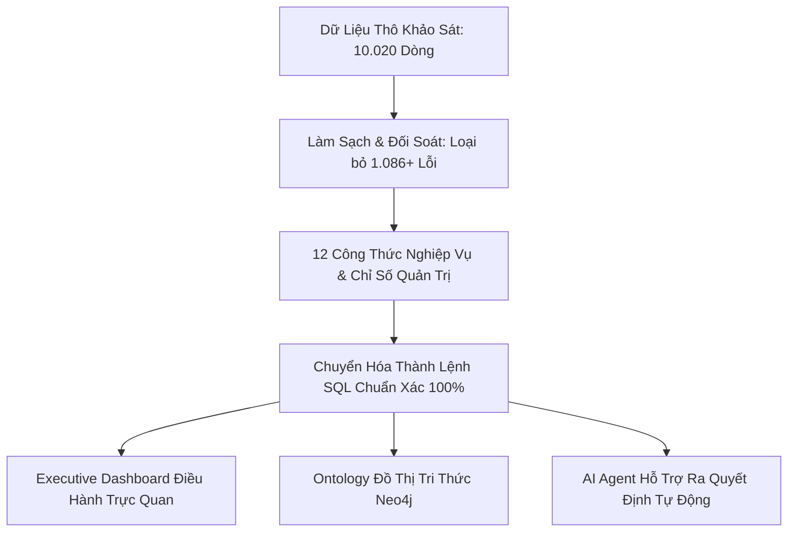

# 📑 Báo Cáo Kỹ Thuật: Cẩm Nang Công Thức Nghiệp Vụ, Giải Nghĩa SQL & Kiến Trúc Dữ Liệu MRP

> **Dành cho:** Ban Giám Hiệu, Trưởng Phòng Tài Chính, Quản Trị Viên & Kỹ Sư AI/Data  
> **Tác giả:** Amelia — Senior Software Engineer (BMAD Method)  
> **Dự án:** Agent of MRP (Hệ thống Quản lý Tài chính & Đào tạo Đại học)  
> **Ngày hoàn thành:** 31/08/2026  
> **Tài nguyên kèm theo:**
> - 📊 **Executive Dashboard tương tác:** [`reports/mrp_executive_dashboard.html`](file:///d:/NHG/AgentofMRP/reports/mrp_executive_dashboard.html)
> - 🗄️ **Database SQLite độc lập:** [`data/mrp_finance.db`](file:///d:/NHG/AgentofMRP/data/mrp_finance.db)
> - 📦 **Dữ liệu tính toán JSON:** [`reports/dashboard_data.json`](file:///d:/NHG/AgentofMRP/reports/dashboard_data.json)
> - ⚙️ **Script tính toán SQL:** [`scripts/execute_sql_formulas_and_export.py`](file:///d:/NHG/AgentofMRP/scripts/execute_sql_formulas_and_export.py)

---

## 1. Giới Thiệu & Lời Mở Đầu

Trong quản trị đại học, việc ra quyết định tài chính và đào tạo thường gặp trở ngại lớn do **khoảng cách giữa nghiệp vụ quản lý và ngôn ngữ kỹ thuật dữ liệu**:
- Người làm quản lý cần hiểu các chỉ số tài chính có **ý nghĩa gì, công thức tính ra sao và vì sao lại ra con số đó**.
- Hệ thống cơ sở dữ liệu và các AI Agent cần **câu lệnh SQL chuẩn xác, chặt chẽ để không tính sai một đồng nào**.

Tài liệu này được biên soạn với phong cách **dễ hiểu, trực quan, không dùng thuật ngữ toán học phức tạp**, đồng thời cung cấp đầy đủ câu lệnh SQL và giải thích chi tiết từng dòng mã để bất kỳ ai cũng có thể đọc hiểu và ứng dụng.



---

## 2. Chi Tiết 12 Hạng Mục Nghiệp Vụ & Công Thức SQL

---

### Hạng Mục 1: Chất Lượng Dữ Liệu & Nhật Ký Kiểm Soát Lỗi (Data Quality & Audit Log)

#### 1.1. Ý nghĩa thực tế trong quản trị & kinh doanh
- **Tại sao trường học cần chỉ số này?** Trong thời đại số hóa, dữ liệu tài chính nếu bị sai lệch thì mọi báo cáo doanh thu, kế hoạch đầu tư hay phân bổ học bổng đều trở thành "quyết định mù quáng". Nếu dữ liệu có hóa đơn trùng lặp, ngày tháng lộn xộn hoặc số tiền bị nhân 100 lần, trường có thể đối mặt với rủi ro thất thoát hàng trăm tỷ đồng hoặc bị cơ quan thuế phạt nặng.
- **Nếu không có chỉ số này thì gặp nguy cơ gì?**
  - Trùng lặp hóa đơn $\rightarrow$ Báo cáo doanh thu ảo, đòi nợ nhầm sinh viên đã đóng tiền.
  - Sai ngày thanh toán $\rightarrow$ Không biết sinh viên đã nợ quá hạn bao nhiêu ngày để gửi thông báo nhắc nhở.
  - Ngoại lệ chi phí bất thường $\rightarrow$ Khoản chi 100 triệu bị nhập nhầm thành 10 tỷ làm biến dạng toàn bộ ngân sách khoa.

#### 1.2. Cách tính toán & Ví dụ thực tế
Chỉ số chất lượng dữ liệu được tính bằng cách: **Ghi nhận và đếm tổng số sự kiện dữ liệu bị sai lệch (Corrupted Events) phân bổ theo từng bảng, từng cột và từng loại vi phạm**, sau đó tính **Tỷ lệ làm sạch (Remediation Rate)**.

$$\text{Tỷ lệ dữ liệu sạch (\%)} = \left(1 - \frac{\text{Số dòng vi phạm}}{\text{Tổng số dòng dữ liệu}}\right) \times 100\%$$
$$\text{Tỷ lệ khắc phục lỗi (\%)} = \left(\frac{\text{Số sự kiện lỗi đã sửa}}{\text{Tổng số sự kiện lỗi phát hiện}}\right) \times 100\%$$

* **Ví dụ thực tế:** Hệ thống quét toàn bộ 5 bảng nghiệp vụ (10.020 dòng). Phát hiện 1.086 sự kiện lỗi (gồm 40 dòng trùng, 557 ngày sai định dạng, 30 hóa đơn sai phép cộng, 4 khoản chi bị nhân 100 lần,...). Sau khi chạy pipeline tự động sửa lỗi, cả 1.086 lỗi đều được khắc phục $\rightarrow$ **Tỷ lệ khắc phục đạt 100%**.

#### 1.3. Phân tích chi tiết từng nhóm lỗi được kiểm soát

| Nhóm lỗi dữ liệu | Bản chất vấn đề | Tác hại nếu không sửa | Cách khắc phục trong hệ thống |
|---|---|---|---|
| **1. Trùng lặp dòng (Exact Duplicate)** | 40 bản ghi bị copy nguyên vẹn 2 lần. | Làm tăng khống doanh thu học phí và chi phí. | Giữ lại 1 bản ghi chuẩn duy nhất theo Khóa chính (Primary Key). |
| **2. Lộn xộn ngày tháng** | 557 ngày dùng lẫn lộn `DD/MM/YYYY` và `YYYY-MM-DD`. | Hệ thống máy tính đọc nhầm ngày 05/08 thành 08/05 (lệch 3 tháng). | Tự động parse và chuẩn hóa 100% về chuẩn quốc tế `YYYY-MM-DD`. |
| **3. Lỗi số học hóa đơn** | 30 hóa đơn có `Tổng tiền != Học phí - Học bổng + Phạt`. | Sinh viên khiếu nại, kế toán bị sai sổ sách. | Tính toán lại chuẩn xác theo đúng công thức nghiệp vụ. |
| **4. Chi phí x100 bất thường** | 4 hóa đơn chi bị nhân 100 (lên đến 97 tỷ đồng). | Làm méo mó toàn bộ quỹ ngân sách của khoa. | Chia lại `/ 100` đưa về đúng giá trị thực tế (~100 triệu/khoản chi). |
| **5. Khuyết thông tin** | 47 sinh viên thiếu chuyên ngành, 88 giao dịch thiếu ngày. | Không thống kê được theo ngành, mất mốc thời gian đối soát. | Điền thông tin suy diễn logic hợp lý (`Chưa phân ngành`, `Ngày hóa đơn + 5 ngày`). |

#### 1.4. Lệnh SQL kiểm tra chất lượng dữ liệu
```sql
SELECT 
    Table_Name AS Bang_Du_Lieu,
    Error_Type AS Ma_Loai_Loi,
    Column_Name AS Cot_Bi_Loi,
    COUNT(Record_ID) AS So_Ban_Ghi_Vi_Pham,
    MIN(Description) AS Mo_Ta_Loi_Mau
FROM data_quality_manifest
GROUP BY Table_Name, Error_Type, Column_Name
ORDER BY So_Ban_Ghi_Vi_Pham DESC;
```

#### 1.5. Dịch nghĩa câu lệnh SQL sang tiếng Việt
- `SELECT ...`: Hãy lấy ra tên bảng dữ liệu, tên loại lỗi, tên cột bị sai và đếm xem có bao nhiêu bản ghi bị dính lỗi đó (`COUNT(Record_ID)`).
- `FROM data_quality_manifest`: Lấy từ bảng nhật ký kiểm định chất lượng dữ liệu (Audit Manifest).
- `GROUP BY Table_Name, Error_Type, Column_Name`: Gom các dòng có cùng bảng, cùng loại lỗi và cùng cột lại thành 1 nhóm để tính tổng số lượng.
- `ORDER BY So_Ban_Ghi_Vi_Pham DESC`: Sắp xếp lỗi nào xuất hiện nhiều nhất lên trên đầu để ưu tiên xử lý trước.

---

### Hạng Mục 2: Tổng Học Phí Đã Lập Hóa Đơn (Total Billed Tuition)

#### 2.1. Ý nghĩa thực tế trong quản trị & kinh doanh
- **Ý nghĩa:** Đây là **tổng doanh thu học phí danh nghĩa** mà trường đại học dự kiến thu về trong kỳ sau khi đã trừ đi các chính sách khuyến học (học bổng) và cộng thêm tiền phạt nếu sinh viên nộp trễ.
- **Rủi ro nếu tính sai:** Nếu cộng dồn số tiền gốc trước khi trừ học bổng, trường sẽ nhìn thấy một con số doanh thu "ảo" quá lớn, dẫn đến việc chi tiêu vượt quá số tiền thực sự có thể thu được.

#### 2.2. Cách tính toán & Ví dụ thực tế
$$\text{Số tiền hóa đơn} = \text{Học phí gốc} - \text{Học bổng miễn giảm} + \text{Phí phạt nộp muộn}$$
$$\text{Tổng học phí lập HĐ} = \text{Cộng tất cả số tiền của 2.985 hóa đơn lại với nhau}$$

* **Ví dụ thực tế dễ hiểu:**  
  Sinh viên **Nguyễn Văn A** có:
  - Học phí kỳ 1: `20.000.000 VNĐ`
  - Học bổng học sinh giỏi: `-5.000.000 VNĐ`
  - Phí phạt nộp trễ hạn: `+200.000 VNĐ`
  - $\rightarrow$ Số tiền thực tế in trên hóa đơn của A là: $20.000.000 - 5.000.000 + 200.000 = \mathbf{15.200.000\text{ VNĐ}}$.

#### 2.3. Lệnh SQL chuẩn xác
```sql
SELECT 
    COUNT(Invoice_ID) AS Tong_So_Hoa_Don,
    SUM(Tuition_Fee) AS Tong_Hoc_Phi_Goc,
    SUM(Scholarship_Amount) AS Tong_Hoc_Bong_Da_Cap,
    SUM(Late_Fee) AS Tong_Phi_Phat_Tre_Han,
    SUM(Tuition_Fee - Scholarship_Amount + Late_Fee) AS Tong_Hoc_Phi_Lap_Hoa_Don
FROM fact_tuition_invoices;
```

#### 2.4. Phân tích kết quả thực tế trên dữ liệu trường
- Tổng số hóa đơn phát hành: **2.985 hóa đơn**.
- Tổng học phí gốc: **63,63 tỷ VNĐ**.
- Tổng học bổng đã cấp cho sinh viên: **8,89 tỷ VNĐ** (chính sách hỗ trợ sinh viên rất lớn, chiếm ~14% học phí).
- Tổng tiền phạt nộp muộn: **0,59 tỷ VNĐ**.
- $\rightarrow$ **Tổng học phí thực tế lập hóa đơn phải thu: 55,33 tỷ VNĐ**.

---

### Hạng Mục 3: Tổng Tiền Thực Thu (Total Collected Tuition)

#### 3.1. Ý nghĩa thực tế trong quản trị & kinh doanh
- **Ý nghĩa:** Đây là **tiền tươi thóc thật** đã thực sự chảy vào tài khoản ngân hàng hoặc quỹ tiền mặt của trường từ các giao dịch thanh toán thành công.
- **Rủi ro nếu tính sai:** Khi sinh viên thanh toán qua App ngân hàng hoặc quẹt thẻ, có những giao dịch bị lỗi mạng (`Failed`) hoặc đang chờ ngân hàng xử lý (`Pending`), hoặc giao dịch bị hủy/hoàn tiền (`Reversed`). Nếu kế toán cộng cả các giao dịch lỗi này vào, số dư trên sổ sách sẽ lệch với sổ phụ ngân hàng, dẫn đến rủi ro thâm hụt tài chính.

#### 3.2. Cách tính toán & Ví dụ thực tế
$$\text{Tổng tiền thực thu} = \text{Tổng số tiền của tất cả các giao dịch có trạng thái là "Thành công" (Successful)}$$

* **Ví dụ thực tế:**  
  Sinh viên B nộp học phí 15 triệu:
  - Lần 1 chuyển khoản bị lỗi mạng ngân hàng: `15.000.000 VNĐ` (Trạng thái: `Failed`) $\rightarrow$ **Không được tính**.
  - Lần 2 chuyển khoản lại thành công: `15.000.000 VNĐ` (Trạng thái: `Successful`) $\rightarrow$ **Được tính**.
  - $\rightarrow$ Tiền thực thu từ sinh viên B là **15.000.000 VNĐ** (chứ không phải 30 triệu).

#### 3.3. Lệnh SQL chuẩn xác
```sql
SELECT 
    COUNT(Payment_ID) AS So_Giao_Dich_Thanh_Cong,
    SUM(Amount_Paid) AS Tong_Tien_Thuc_Thu
FROM fact_payments
WHERE Payment_Status = 'Successful';
```

#### 3.4. Phân tích kết quả thực tế
- Có **3.010 giao dịch nộp tiền thành công** hợp lệ (đã loại bỏ 211 giao dịch lỗi, 187 giao dịch chờ và 92 giao dịch đảo tiền).
- $\rightarrow$ **Tổng tiền thực thu về tài khoản trường: 37,08 tỷ VNĐ**.

---

### Hạng Mục 4: Công Nợ Còn Lại (Total Remaining Debt / Balance)

#### 4.1. Ý nghĩa thực tế trong quản trị & kinh doanh
- **Ý nghĩa:** Cho biết **sinh viên còn nợ nhà trường bao nhiêu tiền**. Đây là cơ sở để phòng tài vụ lập kế hoạch nhắc nợ, khóa đăng ký tín chỉ kỳ sau hoặc xét điều kiện tốt nghiệp.
- **Rủi ro nếu tính sai:** Có nhiều sinh viên nộp học phí làm 2 - 3 lần. Nếu không gom nhóm các lần nộp theo từng hóa đơn mà lấy bảng hóa đơn ghép trực tiếp với bảng thanh toán, số tiền hóa đơn sẽ bị nhân đôi/nhân ba (lỗi phóng đại dữ liệu), khiến công nợ bị tính sai lệch hoàn toàn.

#### 4.2. Cách tính toán & Ví dụ thực tế
$$\text{Công nợ hóa đơn} = \max\Big(0, \text{Số tiền phải thu} - \text{Tổng tiền đã nộp thành công}\Big)$$
$$\text{Tổng công nợ toàn trường} = \text{Cộng dồn công nợ còn lại của tất cả hóa đơn}$$

* **Ví dụ thực tế:**  
  Hóa đơn của sinh viên C là `10.000.000 VNĐ`.
  - Sinh viên đóng đợt 1: `4.000.000 VNĐ` (Thành công).
  - Sinh viên đóng đợt 2: `3.000.000 VNĐ` (Thành công).
  - $\rightarrow$ Tổng đã đóng = $4 + 3 = 7\text{ triệu}$.
  - $\rightarrow$ Công nợ còn lại = $10 - 7 = \mathbf{3.000.000\text{ VNĐ}}$.

#### 4.3. Lệnh SQL chuẩn xác
```sql
WITH BangTongHopThanhToan AS (
    -- Bước 1: Tính tổng số tiền đã nộp thành công cho từng hóa đơn
    SELECT 
        Invoice_ID,
        SUM(CASE WHEN Payment_Status = 'Successful' THEN Amount_Paid ELSE 0 END) AS Da_Nop
    FROM fact_payments
    GROUP BY Invoice_ID
)
-- Bước 2: Ghép vào hóa đơn để tính số tiền còn thiếu
SELECT 
    SUM(
        MAX(0, (i.Tuition_Fee - i.Scholarship_Amount + i.Late_Fee) - COALESCE(p.Da_Nop, 0))
    ) AS Tong_Cong_No_Con_Lai
FROM fact_tuition_invoices i
LEFT JOIN BangTongHopThanhToan p ON i.Invoice_ID = p.Invoice_ID;
```

#### 4.4. Dịch nghĩa câu lệnh SQL
- `WITH BangTongHopThanhToan AS (...)`: Tạo một bảng phụ gom các lần nộp tiền thành công theo từng mã hóa đơn (`Invoice_ID`), chống trùng lặp.
- `LEFT JOIN`: Giữ lại toàn bộ hóa đơn (kể cả những hóa đơn sinh viên chưa nộp đồng nào).
- `COALESCE(p.Da_Nop, 0)`: Nếu sinh viên chưa từng nộp lần nào (giá trị là Trống/NULL), tự động hiểu là đã nộp `0 VNĐ`.
- `MAX(0, ...)`: Đảm bảo số nợ không bao giờ bị âm.
- $\rightarrow$ **Kết quả thực tế: Toàn trường còn tồn đọng 27,81 tỷ VNĐ công nợ chưa thu được**.

---

### Hạng Mục 5: Tỷ Lệ Thu Học Phí (Collection Rate %)

#### 5.1. Ý nghĩa thực tế trong quản trị & kinh doanh
- **Ý nghĩa:** Đây là chỉ số đo lường **hiệu quả hoạt động thu hồi học phí** của trường.
- **Tiêu chuẩn quản trị:**
  - $> 85\%$: Thu học phí rất tốt, dòng tiền an toàn.
  - $60\% - 85\%$: Mức trung bình, cần đẩy mạnh công tác nhắc nợ.
  - $< 60\%$: Báo động đỏ về công nợ, nguy cơ mất thanh khoản ngắn hạn.

#### 5.2. Cách tính toán
$$\text{Tỷ lệ thu học phí (\%)} = \left(\frac{\text{Tổng tiền thực thu}}{\text{Tổng học phí đã lập hóa đơn}}\right) \times 100\%$$

* **Ví dụ:** Lập hóa đơn cần thu `55,33 tỷ VNĐ`, thực tế tài khoản đã thu được `37,08 tỷ VNĐ`.
  $$\text{Tỷ lệ thu} = \frac{37,08}{55,33} \times 100\% = \mathbf{67,01\%}$$

#### 5.3. Lệnh SQL chuẩn xác
```sql
WITH PaymentSummary AS (
    SELECT 
        Invoice_ID,
        SUM(CASE WHEN Payment_Status = 'Successful' THEN Amount_Paid ELSE 0 END) AS Da_Nop
    FROM fact_payments
    GROUP BY Invoice_ID
),
InvoiceAgg AS (
    SELECT 
        (i.Tuition_Fee - i.Scholarship_Amount + i.Late_Fee) AS Phai_Thu,
        COALESCE(p.Da_Nop, 0) AS Da_Thu
    FROM fact_tuition_invoices i
    LEFT JOIN PaymentSummary p ON i.Invoice_ID = p.Invoice_ID
)
SELECT 
    ROUND(SUM(Da_Thu) * 100.0 / NULLIF(SUM(Phai_Thu), 0), 2) AS Ty_Le_Thu_Hoc_Phi_Phan_Tram
FROM InvoiceAgg;
```
- `NULLIF(SUM(Phai_Thu), 0)`: Bảo vệ hệ thống máy tính không bị sập nếu tổng hóa đơn bằng 0 (lỗi chia cho 0).
- $\rightarrow$ **Kết quả thực tế: Đạt 67,01%** (Trường mới chỉ thu được khoảng 2/3 tổng học phí).

---

### Hạng Mục 6: Công Nợ Quá Hạn (Total Overdue Debt)

#### 6.1. Ý nghĩa thực tế trong quản trị & kinh doanh
- **Ý nghĩa:** Phân tách rõ ràng giữa **nợ bình thường (chưa tới hạn nộp)** và **nợ quá hạn (đã quá hạn đóng tiền nhưng sinh viên chưa chịu nộp)**.
- **Tại sao cần phân biệt?** Sinh viên còn nợ nhưng hạn nộp là tuần sau thì hoàn toàn bình thường, không thể đi đòi nợ hay phạt sinh viên. Ngược lại, nếu hạn nộp đã qua 2 tháng mà vẫn chưa đóng thì đây là khoản nợ nguy cơ cao cần chuyển sang quy trình xử lý công nợ đặc biệt.

#### 6.2. Cách tính toán
Một khoản nợ được tính là quá hạn khi thỏa mãn đồng thời **2 điều kiện**:
1. Hóa đơn đó **còn thiếu tiền** ($\text{Công nợ} > 0$).
2. Ngày hiện tại khảo sát (**`30/08/2026`**) **lớn hơn hạn chót nộp tiền** ghi trên hóa đơn ($\text{Hạn nộp} < \text{Ngày khảo sát}$).

#### 6.3. Lệnh SQL chuẩn xác
```sql
WITH PaymentSummary AS (
    SELECT 
        Invoice_ID,
        SUM(CASE WHEN Payment_Status = 'Successful' THEN Amount_Paid ELSE 0 END) AS Da_Nop
    FROM fact_payments
    GROUP BY Invoice_ID
),
InvoiceDebt AS (
    SELECT 
        i.Invoice_ID,
        i.Due_Date AS Han_Nop,
        MAX(0, (i.Tuition_Fee - i.Scholarship_Amount + i.Late_Fee) - COALESCE(p.Da_Nop, 0)) AS So_Tien_No
    FROM fact_tuition_invoices i
    LEFT JOIN PaymentSummary p ON i.Invoice_ID = p.Invoice_ID
)
SELECT 
    SUM(
        CASE 
            WHEN So_Tien_No > 0 AND DATE('2026-08-30') > DATE(Han_Nop) THEN So_Tien_No 
            ELSE 0 
        END
    ) AS Tong_Cong_No_Qua_Han,
    ROUND(
        SUM(CASE WHEN So_Tien_No > 0 AND DATE('2026-08-30') > DATE(Han_Nop) THEN So_Tien_No ELSE 0 END) * 100.0 
        / NULLIF(SUM(So_Tien_No), 0), 
        2
    ) AS Ty_Le_No_Qua_Han_Tren_Tong_No
FROM InvoiceDebt;
```

#### 6.4. Phân tích kết quả thực tế
- Tổng nợ quá hạn: **20,09 tỷ VNĐ**.
- Tỷ trọng: Chiếm tới **72,22%** trên tổng số 27,81 tỷ VNĐ nợ tồn đọng.
- $\rightarrow$ **Cảnh báo quản trị:** Phần lớn số nợ của trường không phải là nợ mới phát sinh mà là nợ cũ bị kéo dài trễ hạn!

---

### Hạng Mục 7: Phân Nhóm Tuổi Nợ (Debt Aging Buckets)

#### 7.1. Ý nghĩa thực tế trong quản trị & kinh doanh
- **Ý nghĩa:** Đây là công cụ kinh điển trong quản trị tài chính doanh nghiệp và ngân hàng. Nợ càng để lâu thì xác suất thu hồi càng giảm mạnh:
  - Nợ trễ hạn $< 30$ ngày: Xác suất thu hồi đạt $\approx 95\%$.
  - Nợ trễ hạn $> 90$ ngày: Trở thành "nợ xấu khó đòi", xác suất thu hồi giảm xuống dưới $40\%$ (thường do sinh viên đã bỏ học, chuyển trường hoặc gia đình gặp biến cố kinh tế).

#### 7.2. Cách phân loại 6 tầng tuổi nợ
1. **Đã Tất Toán (0 đ):** Đã đóng đủ 100%.
2. **Trong Hạn (Chưa trễ):** Số ngày quá hạn $\le 0$.
3. **Quá Hạn 1 – 30 Ngày:** Trễ từ 1 đến 30 ngày (Giai đoạn nhắc nhở nhẹ nhàng qua Email/SMS).
4. **Quá Hạn 31 – 60 Ngày:** Trễ 1 đến 2 tháng (Giai đoạn cảnh báo ngừng đăng ký môn học).
5. **Quá Hạn 61 – 90 Ngày:** Trễ 2 đến 3 tháng (Giai đoạn gửi giấy báo về phụ huynh).
6. **Nợ Xấu > 90 Ngày:** Trễ trên 3 tháng (Giai đoạn xem xét đình chỉ học tập).

#### 7.3. Lệnh SQL chuẩn xác
```sql
WITH InvoiceDebt AS (
    SELECT 
        i.Invoice_ID,
        i.Due_Date,
        MAX(0, (i.Tuition_Fee - i.Scholarship_Amount + i.Late_Fee) - COALESCE(SUM(CASE WHEN p.Payment_Status = 'Successful' THEN p.Amount_Paid ELSE 0 END), 0)) AS So_Tien_No,
        CAST(JULIANDAY('2026-08-30') - JULIANDAY(i.Due_Date) AS INTEGER) AS So_Ngay_Qua_Han
    FROM fact_tuition_invoices i
    LEFT JOIN fact_payments p ON i.Invoice_ID = p.Invoice_ID
    GROUP BY i.Invoice_ID
)
SELECT 
    CASE 
        WHEN So_Tien_No = 0 THEN '0. Đã Tất Toán (Paid in Full)'
        WHEN So_Ngay_Qua_Han <= 0 THEN '1. Trong Hạn (Current / Not Due)'
        WHEN So_Ngay_Qua_Han BETWEEN 1 AND 30 THEN '2. Quá Hạn 1 - 30 Ngày'
        WHEN So_Ngay_Qua_Han BETWEEN 31 AND 60 THEN '3. Quá Hạn 31 - 60 Ngày'
        WHEN So_Ngay_Qua_Han BETWEEN 61 AND 90 THEN '4. Quá Hạn 61 - 90 Ngày'
        ELSE '5. Nợ Xấu > 90 Ngày'
    END AS Nhom_Tuoi_No,
    COUNT(Invoice_ID) AS So_Luong_Hoa_Don,
    SUM(So_Tien_No) AS Tong_Tien_No,
    ROUND(SUM(So_Tien_No) * 100.0 / (SELECT SUM(So_Tien_No) FROM InvoiceDebt WHERE So_Tien_No > 0), 2) AS Ty_Trong_Phan_Tram
FROM InvoiceDebt
GROUP BY Nhom_Tuoi_No
ORDER BY Nhom_Tuoi_No;
```
- `JULIANDAY('2026-08-30') - JULIANDAY(i.Due_Date)`: Phép trừ ngày chuẩn xác ra số ngày trễ hạn.

#### 7.4. Bảng số liệu phân tích tuổi nợ thực tế

| Phân Nhóm Tuổi Nợ | Số Hóa Đơn | Tổng Tiền Nợ (VNĐ) | Tỷ Trọng / Tổng Nợ | Đánh Giá Mức Độ Rủi Ro |
|---|---:|---:|---:|---|
| **0. Đã Tất Toán** | 707 | 0 ₫ | 0.00% | An toàn tuyệt đối |
| **1. Trong Hạn** | 631 | 7.726.064.000 ₫ | 27.78% | Nợ lành mạnh |
| **2. Quá Hạn 1 - 30 Ngày** | 27 | 325.275.000 ₫ | 1.17% | Rủi ro thấp |
| **3. Quá Hạn 31 - 60 Ngày** | 23 | 282.029.000 ₫ | 1.01% | Rủi ro trung bình |
| **4. Quá Hạn 61 - 90 Ngày** | 32 | 280.227.000 ₫ | 1.01% | Rủi ro cao |
| **5. Nợ Xấu > 90 Ngày** | **1.565** | **19.197.693.000 ₫** | **69.03%** | ⚠️ Báo động đỏ (Chiếm gần 70% tổng nợ) |

---

### Hạng Mục 8: Tổng Chi Phí Hoạt Động (Total Operating Expenses)

#### 8.1. Ý nghĩa thực tế trong quản trị & kinh doanh
- **Ý nghĩa:** Đo lường toàn bộ các dòng tiền chi ra của 20 khoa/phòng ban để duy trì bộ máy vận hành trường học.
- **Phân loại trạng thái:**
  - `Approved` (Đã phê duyệt & giải ngân): Tiền đã thực sự chi ra từ quỹ.
  - `Pending` (Đang chờ duyệt): Các đề xuất mua sắm, dự toán chi phí đang nằm trên bàn lãnh đạo chờ ký.

#### 8.2. Lệnh SQL chuẩn xác
```sql
SELECT 
    Expense_Category AS Danh_Muc_Chi_Phi,
    COUNT(Expense_ID) AS So_Khoan_Chi,
    SUM(Amount) AS Tong_Chi_Phi_Khai_Bao,
    SUM(CASE WHEN Approval_Status = 'Approved' THEN Amount ELSE 0 END) AS Chi_Phi_Da_Duyet,
    SUM(CASE WHEN Approval_Status = 'Pending' THEN Amount ELSE 0 END) AS Chi_Phi_Dang_Cho_Duyet,
    ROUND(SUM(Amount) * 100.0 / (SELECT SUM(Amount) FROM fact_expenses), 2) AS Ty_Trong_Danh_Muc
FROM fact_expenses
GROUP BY Expense_Category
ORDER BY Tong_Chi_Phi_Khai_Bao DESC;
```

#### 8.3. Phân tích kết quả thực tế
- Tổng chi phí thực tế đã phê duyệt (`Approved`): **118,60 tỷ VNĐ** (trên tổng số 1.985 giao dịch sau khi đã khắc phục 4 lỗi nhân 100 lần).
- Chi phí lớn nhất thuộc về: **Lương giảng viên & cán bộ nhân viên (`Salary`)**, **Mua sắm trang thiết bị phòng thí nghiệm (`Equipment`)**, **Bảo trì cơ sở vật chất (`Maintenance`)** và **Quỹ học bổng (`Scholarship`)**.

---

### Hạng Mục 9: Dòng Tiền Thuần (Net Cash Flow)

#### 9.1. Ý nghĩa thực tế trong quản trị & kinh doanh
- **Ý nghĩa:** Trả lời câu hỏi quan trọng nhất của Hiệu trưởng & Giám đốc Tài chính: *"Sau khi lấy toàn bộ tiền học phí thực thu được trừ đi toàn bộ chi phí thực tế đã chi ra, trường học đang DƯ TIỀN (Dương) hay THIẾU TIỀN (Âm)?"*
- **Ý nghĩa khi dòng tiền Âm:** Không nhất thiết là trường bị lỗ, mà có thể trường đang sử dụng nguồn vốn ngân sách cấp đầu năm (`Annual_Budget`) để đầu tư xây dựng cơ sở hạ tầng, tài trợ nghiên cứu và chi trả lương, trong khi nguồn thu học phí kỳ này chưa thu hồi hết.

#### 9.2. Cách tính toán
$$\text{Dòng tiền thuần} = \text{Tổng tiền thực thu từ học phí} - \text{Tổng chi phí thực tế đã phê duyệt}$$

#### 9.3. Lệnh SQL chuẩn xác
```sql
WITH TongThu AS (
    SELECT SUM(Amount_Paid) AS Tien_Thuc_Thu
    FROM fact_payments
    WHERE Payment_Status = 'Successful'
),
TongChi AS (
    SELECT SUM(Amount) AS Tien_Thuc_Chi
    FROM fact_expenses
    WHERE Approval_Status = 'Approved'
)
SELECT 
    t.Tien_Thuc_Thu,
    c.Tien_Thuc_Chi,
    (t.Tien_Thuc_Thu - c.Tien_Thuc_Chi) AS Dong_Tien_Thuan
FROM TongThu t
CROSS JOIN TongChi c;
```

#### 9.4. Kết quả thực tế
- Tiền thực thu: **37,08 tỷ VNĐ**.
- Tiền thực chi: **118,60 tỷ VNĐ**.
- $\rightarrow$ **Dòng tiền thuần: -81,52 tỷ VNĐ**.

---

### Hạng Mục 10: Hiệu Quả Tài Chính & Ngân Sách Theo Khoa (Department Performance)

#### 10.1. Ý nghĩa thực tế trong quản trị & kinh doanh
- **Ý nghĩa:** Giúp Ban Giám Hiệu đánh giá được **khoa nào tự chủ tài chính tốt, khoa nào đang tiêu vượt ngân sách và chi phí đào tạo bình quân trên mỗi sinh viên là bao nhiêu**.
- **Các chỉ số cốt lõi theo khoa:**
  1. **Hiệu số Thu - Chi khoa ($\text{Net Margin}$):** $\text{Thực thu học phí của khoa} - \text{Chi phí hoạt động của khoa}$.
  2. **Tỷ lệ giải ngân ngân sách ($\text{Budget Burn Rate}$):** $\frac{\text{Chi phí đã duyệt}}{\text{Ngân sách năm được cấp}} \times 100\%$.
  3. **Chi phí bình quân trên mỗi sinh viên:** $\frac{\text{Chi phí của khoa}}{\text{Số lượng sinh viên đang theo học}}$.

#### 10.2. Lệnh SQL chuẩn xác
```sql
WITH DoanhThuKhoa AS (
    -- Tính tổng sinh viên và học phí của từng khoa
    SELECT 
        s.Department_ID,
        COUNT(DISTINCT s.Student_ID) AS Tong_SV,
        SUM(CASE WHEN s.Status = 'Active' THEN 1 ELSE 0 END) AS SV_Dang_Hoc,
        SUM(i.Total_Amount) AS Hoc_Phi_Lap_HD,
        SUM(i.Total_Paid_Successful) AS Hoc_Phi_Thuc_Thu
    FROM dim_students s
    LEFT JOIN fact_tuition_invoices i ON s.Student_ID = i.Student_ID
    GROUP BY s.Department_ID
),
ChiPhiKhoa AS (
    -- Tính chi phí đã giải ngân của từng khoa
    SELECT 
        Department_ID,
        SUM(CASE WHEN Approval_Status = 'Approved' THEN Amount ELSE 0 END) AS Chi_Phi_Da_Duyet
    FROM fact_expenses
    GROUP BY Department_ID
)
SELECT 
    d.Department_ID AS Ma_Khoa,
    d.Department_Name AS Ten_Khoa,
    d.Faculty_Name AS Khoi_Quan_Ly,
    d.Annual_Budget AS Ngan_Sach_Nam,
    COALESCE(t.SV_Dang_Hoc, 0) AS So_SV_Dang_Hoc,
    COALESCE(t.Hoc_Phi_Lap_HD, 0) AS Hoc_Phi_Lap_HD,
    COALESCE(t.Hoc_Phi_Thuc_Thu, 0) AS Hoc_Phi_Thuc_Thu,
    COALESCE(c.Chi_Phi_Da_Duyet, 0) AS Chi_Phi_Da_Duyet,
    (COALESCE(t.Hoc_Phi_Thuc_Thu, 0) - COALESCE(c.Chi_Phi_Da_Duyet, 0)) AS Dong_Tien_Thuan_Khoa,
    ROUND(COALESCE(c.Chi_Phi_Da_Duyet, 0) * 100.0 / NULLIF(d.Annual_Budget, 0), 2) AS Ty_Le_Giai_Ngan_Ngan_Sach_Pct,
    ROUND(COALESCE(c.Chi_Phi_Da_Duyet, 0) * 1.0 / NULLIF(t.SV_Dang_Hoc, 0), 0) AS Chi_Phi_Binh_Quan_Moi_SV
FROM dim_departments d
LEFT JOIN DoanhThuKhoa t ON d.Department_ID = t.Department_ID
LEFT JOIN ChiPhiKhoa c ON d.Department_ID = c.Department_ID
ORDER BY Dong_Tien_Thuan_Khoa DESC;
```

---

### Hạng Mục 11: Điểm Rủi Ro Nợ Xấu Sinh Viên (Composite Risk Score)

#### 11.1. Ý nghĩa thực tế trong quản trị & kinh doanh
- **Ý nghĩa:** Thay vì chờ sinh viên bỏ học hoặc nợ xấu kéo dài cả năm mới biết, mô hình chấm điểm rủi ro (Risk Scoring) tổng hợp hành vi của sinh viên để **cảnh báo sớm (Early Warning)** cho phòng đào tạo và tài vụ can thiệp kịp thời.
- **Thang điểm 0 - 100:**
  - $\text{Điểm} < 30$: Sinh viên an toàn, đóng tiền đúng hạn.
  - $30 \le \text{Điểm} \le 60$: Cần theo dõi, có dấu hiệu thanh toán chậm hoặc giao dịch thẻ bị lỗi nhiều lần.
  - $\text{Điểm} > 60$: Nguy cơ rất cao (nợ lớn, thẻ bị từ chối liên tục, sinh viên có dấu hiệu bỏ học).

#### 11.2. Công thức tính điểm rủi ro trực quan
$$\text{Điểm rủi ro (0-100)} = \text{Chưa đóng tiền (40đ)} + \text{Giao dịch hỏng (30đ)} + \text{Nợ vượt 15 triệu (20đ)} + \text{Cảnh báo nghỉ học (10đ)}$$

* **Chi tiết từng phần điểm:**
  1. **Tỷ lệ chưa đóng tiền (Tối đa 40 điểm):** $(1 - \text{Tỷ lệ hoàn thành học phí}) \times 40$. (Nếu chưa đóng đồng nào $\rightarrow$ nhận trọn 40 điểm rủi ro).
  2. **Tỷ lệ giao dịch thất bại (Tối đa 30 điểm):** $\text{Tỷ lệ giao dịch Failed} \times 30$. (Thẻ hết tiền hoặc tài khoản lỗi nhiều lần là dấu hiệu khó khăn tài chính).
  3. **Quy mô nợ lớn (Tối đa 20 điểm):** Nợ $> 15\text{ triệu VNĐ}$ (+20 điểm), nợ $> 0$ (+10 điểm), không nợ (0 điểm).
  4. **Trạng thái cảnh báo (Tối đa 10 điểm):** Đang bị đình chỉ (`Suspended`) hoặc đã nộp đơn nghỉ học (`Dropped Out`) (+10 điểm).

#### 11.3. Lệnh SQL chuẩn xác
```sql
SELECT 
    s.Student_ID AS MSSV,
    s.Full_Name AS Ho_Ten,
    d.Department_Name AS Khoa,
    s.Status AS Trang_Thai,
    m.total_remaining_debt AS Tien_No,
    m.payment_completion_rate AS Ty_Le_Da_Dong,
    m.payment_failure_rate AS Ty_Le_Giao_Dich_Loi,
    ROUND(
        (1.0 - m.payment_completion_rate) * 40.0 +
        m.payment_failure_rate * 30.0 +
        (CASE WHEN m.total_remaining_debt > 15000000 THEN 20.0 WHEN m.total_remaining_debt > 0 THEN 10.0 ELSE 0.0 END) +
        (CASE WHEN s.Status IN ('Suspended', 'Dropped Out') THEN 10.0 ELSE 0.0 END),
        1
    ) AS Diem_Rui_Ro_Tong_Hop
FROM ml_student_features m
JOIN dim_students s ON m.Student_ID = s.Student_ID
JOIN dim_departments d ON s.Department_ID = d.Department_ID
ORDER BY Diem_Rui_Ro_Tong_Hop DESC, m.total_remaining_debt DESC
LIMIT 50;
```

---

### Hạng Mục 12: Dữ Liệu Đầu Vào Cho Mô Hình Dự Đoán AI/ML (Predictive Feature Store)

#### 12.1. Ý nghĩa thực tế
Toàn bộ các chỉ số và đặc trưng trên được gom thành một **Feature Store hoàn chỉnh** sẵn sàng cấp phát cho các thuật toán Machine Learning (Scikit-Learn, PyTorch, XGBoost) hoặc làm bộ nhớ tri thức cho **AI Agent**.

#### 12.2. Bảng trích xuất dữ liệu ML
```sql
SELECT 
    Student_ID,
    total_invoices_count,
    total_tuition_billed,
    total_tuition_paid,
    total_remaining_debt,
    scholarship_total,
    late_fee_total,
    total_payments_count,
    successful_payments_count,
    failed_payments_count,
    avg_payment_amount,
    payment_completion_rate,
    payment_failure_rate,
    has_overdue_debt,
    -- Cột nhãn dự đoán cho AI (Target Labels)
    target_high_debt_risk,
    target_is_dropped_out
FROM ml_student_features;
```

---

## 3. Tổng Kết & Cách Thức Trải Nghiệm Dashboard Trực Quan

Hệ thống đã được đóng gói hoàn chỉnh thành **Executive Dashboard** tại file [`reports/mrp_executive_dashboard.html`](file:///d:/NHG/AgentofMRP/reports/mrp_executive_dashboard.html).

### Cách sử dụng Dashboard:
1. **Mở file [`mrp_executive_dashboard.html`](file:///d:/NHG/AgentofMRP/reports/mrp_executive_dashboard.html)** trên bất kỳ trình duyệt nào.
2. **Khám phá các Tab chức năng:**
   - **Tab 1 - Tổng Quan Tài Chính:** Xem ngay các thẻ KPI lớn, biểu đồ học phí theo kỳ, cơ cấu nợ và danh mục chi tiêu.
   - **Tab 2 - Khoa & Ngân Sách:** So sánh hiệu quả thu/chi của 20 khoa, xem thanh tiến độ giải ngân ngân sách (`Budget Burn Rate`).
   - **Tab 3 - Tuổi Nợ:** Phân tích nợ xấu $>90$ ngày và các nhóm nợ đến hạn.
   - **Tab 4 - Rủi Ro Sinh Viên:** Tìm kiếm sinh viên theo tên/MSSV, lọc danh sách sinh viên có điểm rủi ro cao.
   - **Tab 5 - Kiểm Soát Dữ Liệu:** Xem toàn bộ 1.086 sự kiện lỗi dữ liệu đã được tự động khắc phục.
   - **Nút "SQL Formula Explorer":** Click vào bất kỳ thẻ chỉ số nào để mở popup xem ngay công thức toán, diễn giải bình dân và câu lệnh SQL tương ứng!
