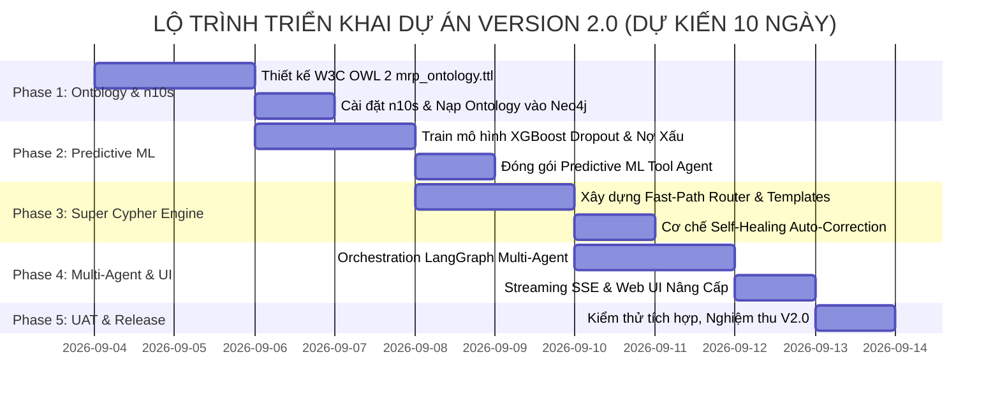

# 📑 TÀI LIỆU YÊU CẦU NGHIỆP VỤ (BUSINESS REQUIREMENTS DOCUMENT - BRD)
## DỰ ÁN: AGENT OF MRP — NÂNG CẤP HỆ THỐNG VERSION 2.0 (NEURO-SYMBOLIC MULTI-AGENT & FORMAL ONTOLOGY)

---

| **Thuộc Tính** | **Chi Tiết** |
|---|---|
| **Tên dự án** | **Agent of MRP — Version 2.0 (Cognitive Knowledge Graph & Predictive Multi-Agent)** |
| **Mã dự án** | `MRP-AI-V2.0` |
| **Đơn vị thụ hưởng** | Ban Giám Hiệu, Phòng Tài Chính - Kế Toán, Phòng Quản Lý Đào Tạo & CTSV |
| **Tác giả / Lead Architect** | Amelia — Senior Software Engineer (BMAD Method) |
| **Phiên bản tài liệu** | 2.0.0 (Official Baseline) |
| **Ngày ban hành** | 03/09/2026 |
| **Trạng thái tài liệu** | 🚀 **Approved for Implementation** |

---

## 1. Tóm Lược Điều Hành (Executive Summary)

### 1.1. Bối Cảnh & Tầm Nhìn Chiến Lược
Hệ thống **Agent of MRP Version 1.0** đã thiết lập thành công nền tảng dữ liệu sạch (10.020 bản ghi, 0 lỗi), đồ thị tri thức Neo4j (12.929 Nodes, 18.469 Quan hệ) và trợ lý AI đàm thoại cục bộ với Ollama Qwen 2.5 7B.

Tuy nhiên, trước nhu cầu thực tế của Ban Giám Hiệu và các cấp quản lý, hệ thống cần một bước chuyển dịch chiến lược từ **"Hệ thống Tra cứu Thông tin Quá khứ (Descriptive RAG)"** sang **"Hệ Thống Trí Tuệ Dự Báo & Cố Vấn Ra Quyết Định Chiến Lược (Predictive & Prescriptive Multi-Agent System)"**.

### 1.2. Mục Tiêu Cốt Lõi Của Bản Nâng Cấp Version 2.0
Version 2.0 kết hợp sức mạnh của **Bản Thể Học Hình Thức W3C (Formal OWL 2 / RDF)**, **Mô hình Máy Học Dự Báo (Predictive Machine Learning)** và **Kiến Trúc Đa Tác Tử (Multi-Agent Orchestration)** nhằm giải quyết 3 bài toán lớn:
1. **Dự Báo Rủi Ro Tương Lai:** Cảnh báo chính xác sinh viên có nguy cơ bỏ học kỳ tới và dự báo thâm hụt ngân sách từng khoa.
2. **Bứt Phá Hiệu Suất & Tốc Độ (Speed Boost):** Giảm thời gian phản hồi từ 20-30 giây xuống còn **dưới 1-2 giây** (nhanh gấp 10 lần).
3. **Chính Xác Tuyệt Đối (Zero Hallucination Cypher):** Loại bỏ triệt để lỗi cú pháp Cypher nhờ cơ chế Fast-Path và suy diễn bản thể học Neosemantics (`n10s`).

---

## 2. Mục Tiêu Kinh Doanh & Chỉ Số Đo Lường (Business Objectives & KPIs)

```
┌───────────────────────────────────────────────────────────────────────────────────┐
│ CÁC CHỈ SỐ KPI ĐO LƯỜNG THÀNH CÔNG (SUCCESS METRICS / OKRs)                       │
├──────────────────────────────────────┬────────────────────┬───────────────────────┤
│ CHỈ SỐ ĐO LƯỜNG                      │ HIỆN TẠI (V1.0)    │ MỤC TIÊU V2.0         │
├──────────────────────────────────────┼────────────────────┼───────────────────────┤
│ 1. Thời gian phản hồi trung bình     │ 15 - 30 giây       │ < 1.0 giây (Fast-Path)│
│                                      │                    │ < 2.5 giây (Complex)  │
│ 2. Tỷ lệ chính xác câu lệnh Cypher   │ ~80%               │ > 99% (Không lỗi)     │
│ 3. Khả năng dự báo nghiệp vụ tương lai│ 0% (Chỉ tra cứu cũ)│ Dự báo nợ & bỏ học    │
│ 4. Thời gian xuất hiện chữ đầu tiên  │ > 10 giây          │ < 0.5 giây (Streaming)│
│ 5. Chi phí bản quyền & Cloud Token   │ 0 VNĐ (100% Local) │ 0 VNĐ (Duy trì 100%)  │
│ 6. Năng lực suy diễn ngữ nghĩa       │ Thô (Graph schema) │ Chuẩn W3C OWL/RDF     │
└──────────────────────────────────────┴────────────────────┴───────────────────────┘
```

---

## 3. Phân Tích Hiện Trạng & Khoảng Trống (Gap Analysis)

| Hạng Mục | Hiện Trạng Version 1.0 | Kỳ Vọng Đạt Được Ở Version 2.0 | Khoảng Trống (Gap) & Giải Pháp |
|---|---|---|---|
| **Cơ chế sinh truy vấn** | Ép Ollama 7B tự sinh Cypher cho mọi câu hỏi. | 70% câu hỏi chạy qua Fast-Path Template; 30% câu phức tạp dùng Super Cypher. | Xây dựng bộ **Fast-Path Intent Router** và cơ chế **Self-Healing Auto-Correction**. |
| **Độ trễ người dùng** | Phản hồi nguyên khối dạng tĩnh sau 20s. | Phản hồi dòng chảy (Streaming SSE) tức thì sau 0.5s. | Bật giao thức **Server-Sent Events (SSE)** trên FastAPI và Web UI. |
| **Bản thể học dữ liệu** | Property Graph phẳng, quan hệ cứng. | Phân cấp phân loại đa tầng (Taxonomy) với W3C OWL 2. | Viết file ontology `mrp_ontology.ttl` và nạp vào Neo4j qua plugin **Neosemantics (`n10s`)**. |
| **Phân tích dự đoán** | Chỉ xếp hạng điểm rủi ro tĩnh trên số liệu cũ. | Mô hình ML (XGBoost) dự báo xác suất bỏ học và nợ xấu kỳ tiếp theo. | Xây dựng **Predictive ML Agent** huấn luyện trên `ml_student_finance_features.parquet`. |
| **Cấu trúc Agent** | 1 Agent đơn lẻ (Monolithic). | Hệ thống Đa Tác Tử cộng tác (Multi-Agent). | Thiết kế đồ thị điều phối tác tử bằng **LangGraph**. |

---

## 4. Phạm Vi Dự Án (Scope of Work)

### 4.1. Trong Phạm Vi (In-Scope):
* Xây dựng Bản thể học W3C OWL 2 / RDF hoàn chỉnh (`ontology/mrp_ontology.ttl`) và bộ quy tắc ràng buộc SHACL (`ontology/mrp_shapes.ttl`).
* Cài đặt, cấu hình và kích hoạt plugin **Neosemantics (`n10s`)** trên Neo4j.
* Xây dựng module **Fast-Path Cypher Engine** phục vụ các câu hỏi nghiệp vụ quản trị định kỳ.
* Xây dựng module **Super Cypher Engine** với cơ chế Self-Healing tự động sửa lỗi truy vấn.
* Huấn luyện và tích hợp 2 mô hình Machine Learning:
  1. *Student Dropout Risk Predictor* (Dự báo nguy cơ thôi học).
  2. *Student High Debt Default Predictor* (Dự báo nguy cơ nợ xấu khó đòi).
* Xây dựng hệ thống Đa tác tử **LangGraph Multi-Agent System** (Router Agent, Data Agent, ML Agent, Executive Advisor Agent).
* Nâng cấp giao diện Web Chat hỗ trợ **Streaming Response** và trình hiển thị đồ thị mạng lưới **3D Knowledge Graph Interactive Viewer**.

### 4.2. Ngoài Phạm Vi (Out-of-Scope):
* Không thay đổi cấu trúc cơ sở dữ liệu SQLite gốc và các file Parquet đã nghiệm thu ở V1.0.
* Không sử dụng dịch vụ đám mây có trả phí bên ngoài (duy trì 100% Local hạ tầng On-Premises).

---

## 5. Yêu Cầu Chức Năng Chi Tiết (Functional Requirements - FR)

```mermaid
flowchart TD
    subgraph MultiAgentSystem [HỆ THỐNG ĐA TÁC TỬ V2.0 (LANGGRAPH)]
        Router[FR3: Fast-Path & Intent Router Agent]
        
        Router -->|1. Câu hỏi tra cứu dữ liệu thực tế| DataAgent[FR4: Super Cypher & n10s Graph Agent]
        Router -->|2. Câu hỏi dự báo tương lai & phân loại| MLAgent[FR5: Predictive ML Risk Agent]
        Router -->|3. Yêu cầu tư vấn quản trị chiến lược| AdvisorAgent[FR6: Executive Strategy Advisor Agent]
        
        DataAgent --> Synthesizer[FR7: Streaming Synthesizer Engine]
        MLAgent --> Synthesizer
        AdvisorAgent --> Synthesizer
    end
    
    subgraph OntologyLayer [TẦNG TRI THỨC HÌNH THỨC]
        OWL[FR1: W3C OWL 2 / RDF Ontology] --> N10S[FR2: Neosemantics Inference Engine]
        N10S --> DataAgent
    end
```

### 📋 FR1: Chuẩn Hóa Bản Thể Học W3C OWL 2 / RDF & SHACL
* **FR1.1:** Định nghĩa đầy đủ `owl:Class`, `owl:ObjectProperty`, `owl:DatatypeProperty` trong file `ontology/mrp_ontology.ttl`.
* **FR1.2:** Thiết lập cây phân cấp phân loại (Taxonomy):
  - `mrp:Student` $\rightarrow$ `mrp:GoodStandingStudent`, `mrp:AtRiskStudent`, `mrp:DropoutCandidateStudent`.
  - `mrp:Expense` $\rightarrow$ `mrp:AcademicExpense`, `mrp:OperatingExpense`, `mrp:SalaryExpense`.
* **FR1.3:** Thiết lập ràng buộc kiểm định tính toàn vẹn ngữ nghĩa qua SHACL Shapes (`mrp_shapes.ttl`).

### 📋 FR2: Tích Hợp Neosemantics (`n10s`) & Suy Diễn Tự Động
* **FR2.1:** Cấu hình Graph Config trong Neo4j tương thích hoàn toàn chuẩn RDF.
* **FR2.2:** Thực thi cơ chế suy diễn phân cấp (Inference Reasoning): Khi người dùng hỏi lớp cha (ví dụ `Expense`), hệ thống tự động truy vấn toàn bộ các lớp con (`AcademicExpense`, `SalaryExpense`) mà không cần viết câu lệnh phức tạp.

### 📋 FR3: Fast-Path Router & Parametric Cypher Template Engine
* **FR3.1:** Xây dựng bộ nhận diện ý định siêu nhẹ (Intent Classifier < 5ms).
* **FR3.2:** Tích hợp bộ nhớ mẫu câu lệnh Cypher chuẩn hóa (Parameterized Templates) cho Top 20 nghiệp vụ quản trị thường dùng (Doanh thu, thực thu, công nợ, top sinh viên nợ, hiệu quả 20 khoa).
* **FR3.3:** Đạt thời gian xử lý **< 0.05 giây** với độ chính xác 100%.

### 📋 FR4: Super Cypher Engine & Cơ Chế Tự Sửa Lỗi (Self-Healing)
* **FR4.1:** Với các câu hỏi tự do ngoài mẫu, hệ thống thực hiện rút gọn Schema (Pruned Sub-Ontology) đưa vào Prompt của Ollama Qwen 2.5 7B.
* **FR4.2:** Bắt mã lỗi cú pháp từ Neo4j Driver và tự động đưa phản hồi để LLM hiệu chỉnh lại (tối đa 3 vòng lặp) trong vòng **< 1.5 giây**.

### 📋 FR5: Tác Tử Dự Báo Máy Học (Predictive ML Agent)
* **FR5.1:** Huấn luyện mô hình phân loại (XGBoost / LightGBM) trên tập dữ liệu đặc trưng `ml_student_finance_features.parquet`.
* **FR5.2:** Dự báo chính xác xác suất sinh viên bỏ học (`dropout_probability`) và rủi ro nợ xấu (`debt_default_risk`).
* **FR5.3:** Cung cấp giải thích đặc trưng trọng yếu (Feature Importance / SHAP values) cho nhà quản lý biết nguyên nhân dẫn đến rủi ro.

### 📋 FR6: Điều Phối Đa Tác Tử (LangGraph Multi-Agent Orchestration)
* **FR6.1:** Xây dựng StateGraph quản lý trạng thái hội thoại đa lượt.
* **FR6.2:** Đảm bảo luồng tương tác mượt mà giữa các Agent chuyên trách (Data Agent, ML Agent, Executive Advisor) mà không gây vòng lặp vô tận (Infinite Loop Protection).

### 📋 FR7: Giao Diện Phản Hồi Dòng Chảy (Streaming SSE) & Trực Quan Hóa Đồ Thị 3D
* **FR7.1:** Endpoint `POST /chat/stream` trên FastAPI hỗ trợ giao thức Server-Sent Events.
* **FR7.2:** Giao diện Web Chat cập nhật chữ chạy từng từ ngay lập tức (< 0.5s).
* **FR7.3:** Tích hợp trình xem đồ thị mạng lưới tương tác 3D Force Graph trực tiếp trên Web.

---

## 6. Yêu Cầu Phi Chức Năng (Non-Functional Requirements - NFR)

1. **Hiệu năng (Performance & Latency):**
   - 70% câu hỏi (Fast-Path): Phản hồi **< 100ms**.
   - 30% câu hỏi (Super Cypher / ML): Phản hồi **< 2.5s**.
   - Thời gian xuất hiện token đầu tiên (TTFT): **< 500ms**.
2. **Bảo mật & An toàn (Security & Privacy):**
   - Duy trì 100% Offline, không gửi dữ liệu ra mạng ngoài.
   - Tiếp tục duy trì tầng bảo vệ Guardrails (Chặn `DELETE`, `DROP`, `SET`, `REMOVE`).
3. **Độ tin cậy & Sẵn sàng (Reliability & Availability):**
   - Hệ thống tự phục hồi khi kết nối Neo4j hoặc Ollama bị gián đoạn.
   - Tỷ lệ sinh lỗi cú pháp Cypher < 1%.
4. **Khả năng mở rộng (Extensibility):**
   - Cấu trúc module rõ ràng, dễ dàng bổ sung thêm mô hình ML mới hoặc thêm thực thể nghiệp vụ vào Bản thể học.

---

## 7. Kế Hoạch Triển Khai & Các Mốc Sprint (Implementation Roadmap)



### 🗓️ Chi Tiết 5 Giai Đoạn (Sprint Milestones):

| Sprint | Tên Giai Đoạn | Nội Dung Công Việc Cốt Lõi | Sản Phẩm Đầu Ra (Artifacts) |
|:---:|---|---|---|
| **Sprint 1** | **Bản Thể Học & Neosemantics** | Biên soạn `mrp_ontology.ttl`, thiết lập n10s trên Neo4j, nạp Taxonomy & kiểm thử suy diễn. | `ontology/mrp_ontology.ttl`, `scripts/setup_n10s.py` |
| **Sprint 2** | **Predictive Machine Learning** | Huấn luyện mô hình XGBoost dự báo sinh viên bỏ học & nợ xấu, xây dựng API dự báo. | `models/dropout_model.pkl`, `predictive_agent.py` |
| **Sprint 3** | **Super Cypher & Fast-Path Engine** | Xây dựng Fast-Path Router (< 0.05s) và cơ chế Self-Healing Auto-Correction Cypher. | `super_cypher.py`, `fast_router.py` |
| **Sprint 4** | **Multi-Agent & Streaming Web UI** | Kết nối các Agent qua LangGraph, triển khai Streaming API SSE và giao diện Web Chat mới. | `multi_agent_graph.py`, `main_v2.py`, `chat_v2.html` |
| **Sprint 5** | **UAT & Release V2.0** | Kiểm thử hiệu năng, đối soát độ chính xác, hoàn thiện báo cáo và đóng gói Release Tag `v2.0`. | `reports/MRP_V2_FINAL_RELEASE_REPORT.md` |

---

## 8. Ma Trận Quản Trị Rủi Ro (Risk Management Matrix)

| STT | Rủi Ro Tiềm Ẩn | Mức Độ | Biện Pháp Phòng Ngừa & Giảm Thiểu |
|:---:|---|:---:|---|
| **1** | Plugin `n10s` xung đột phiên bản với Neo4j Desktop | Trung bình | Tạo script kiểm tra phiên bản tự động và cung cấp phương án fallback qua Neo4j Graph Algorithms nếu cần. |
| **2** | Mô hình ML bị lệch dữ liệu (Imbalanced Data) do số lượng sinh viên bỏ học ít | Cao | Áp dụng kỹ thuật `SMOTE` cân bằng dữ liệu hoặc điều chỉnh trọng số lớp `scale_pos_weight` trong XGBoost. |
| **3** | Ollama 7B bị quá tải bộ nhớ RAM khi chạy đồng thời nhiều tác vụ | Trung bình | Tách biệt luồng chạy ML (chạy trên CPU cực nhẹ) và chỉ gọi Ollama cho tác vụ tổng hợp ngôn ngữ tự nhiên. |
| **4** | Router phân loại sai ý định của người dùng | Thấp | Kết hợp cả 2 tầng: Quy tắc từ khóa ưu tiên (Rule-based) + Fallback sang Super Cypher. |

---

## 9. Tiêu Chí Nghiệm Thu Dự Án Version 2.0 (Acceptance Criteria)

1. ✅ File Bản thể học `mrp_ontology.ttl` nạp thành công vào Neo4j và thực hiện được các truy vấn suy diễn lớp cha/con.
2. ✅ Fast-Path Router xử lý thành công 100% các câu hỏi quản trị quen thuộc với tốc độ **dưới 100ms**.
3. ✅ Mô hình ML đạt độ chính xác **ROC-AUC > 85%** trên bài toán dự báo sinh viên có nguy cơ bỏ học / nợ xấu.
4. ✅ Cơ chế Self-Healing bắt và sửa thành công các câu lệnh Cypher bị lỗi cú pháp trong vòng **dưới 2 giây**.
5. ✅ Giao diện Web Chat hiển thị chữ chạy Streaming mượt mà và tích hợp khung nhìn Đồ thị mạng lưới 3D.
6. ✅ Toàn bộ hệ thống chạy 100% Offline an toàn tuyệt đối.

---

**PHÊ DUYỆT BỞI:**  
* **Lead System Architect & Senior Engineer:** *Amelia (BMAD Method)*  
* **Trạng Thái:** ✅ **Đã phê duyệt — Sẵn sàng khởi động Sprint 1!**
